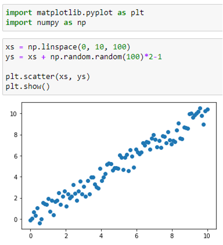
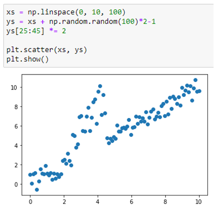

# Practices for MLops course UrFU + SkillFactory
## Module 1
<details>

* Необходимо из создать простейший конвейер для автоматизации работы с моделью машинного обучения. 
* Отдельные этапы конвейера машинного обучения описываются в разных python–скриптах, которые потом соединяются в единую цепочку действий с помощью bash-скрипта.
* Все файлы необходимо разместить в подкаталоге lab1 корневого каталога

Этапы:
1. Создайте python-скрипт (data_creation.py), который создает различные наборы данных, описывающие некий процесс (например, изменение дневной температуры). Таких наборов должно быть несколько, в некоторые данные можно включить аномалии или шумы. 
Часть наборов данных должны быть сохранены в папке “train”, другая часть в папке “test”. Одним из вариантов выполнения этого этапа может быть скачивание набора данных из сети, и разделение выборки на тестовую и обучающую. Учтите, что файл должен быть доступен и методы скачивания либо есть в ubuntu либо устанавливаются через pip в файле pipeline.sh
2. Создайте python-скрипт (data_preprocessing.py), который выполняет предобработку данных, например, с помощью sklearn.preprocessing.StandardScaler. Трансформации выполняются и над тестовой и над обучающей выборкой. 
3. Создайте python-скрипт (model_preparation.py), который создает и обучает модель машинного обучения на построенных данных из папки “train”. Для сохранения модели в файл можно воспользоваться [pickle](https://docs.python.org/3/library/pickle.html) (см. [пример](https://rukovodstvo.net/posts/id_1322/))
4. Создайте python-скрипт (model_testing.py), проверяющий модель машинного обучения на построенных данных из папки “test”.
5. Напишите bash-скрипт (pipeline.sh), последовательно запускающий все python-скрипты. При необходимости усложните скрипт. В результате выполнения скрипта на терминал в стандартный поток вывода печатается одна строка с оценкой метрики на вашей модели, например:

```shell
Model test accuracy is: 0.876
```

Настоятельно рекомендуем вам проверить работоспособность скрипта в окружении отличном от того в котором происходила разработка.
</details>

## Module 2
<details>

* Вам нужно разработать собственный конвейер автоматизации для проекта машинного обучения. Для этого вам понадобится виртуальная машина с установленным Jenkins, python и необходимыми библиотеками. В ходе выполнения практического задания вам необходимо автоматизировать сбор данных, подготовку датасета, обучение модели и работу модели.
* Разработанный конвеер требуется выгрузить в файл. Так же все скрипты (этапы конвеера требуется сохранить)
* Все файлы необходимо разместить в подкаталоге lab2 корневого каталога
Этапы задания

1. Развернуть сервер с Jenkins, установить необходимое программное обеспечение для работы над созданием модели машинного обучения.
2. Выбрать способ получения данных (скачать из github, из Интернета, wget, SQL запрос, …).
3. Провести обработку данных, выделить важные признаки, сформировать датасеты для тренировки и тестирования модели, сохранить.
4. Создать и обучить на тренировочном датасете модель машинного обучения, сохранить в pickle или аналогичном формате.
5. Загрузить сохраненную модель на предыдущем этапе и проанализировать ее качество на тестовых данных. 
6. Реализовать задания и конвеер. Связать конвеер с системой контроля версий. Сохранить конвеер.

</details>

## Module 3
<details>

В практическом задание по модулю вам необходимо применить полученные знания по работе с docker (и docker-compose). Вам необходимо использовать полученные ранее знания по созданию микросервисов. В этом задании необходимо развернуть микросервис в контейнере докер. Например, это может быть модель машинного обучения, принимающая запрос по API и возвращающая ответ. Вариантом может быть реализация приложения на основе streamlit (https://github.com/korelin/streamlit_demo_app).
Результаты работы над этой работой стоит поместить в подкаталог lab3 вашего корневого каталога репозитория.
Что необходимо выполнить:
* Подготовить python код для модели и микросервиса
* Создать Docker file
* Создать docker образ
* Запустить docker контейнер и проверить его работу

Дополнительными плюсами будут:
1. Использование docker-compose
2. Автоматизация сборки образа привязка имени тэга к версии сборки (sha-коммита, имя ветки)
3. Деплой (загрузка) образа в хранилище артефактов например dockerhub

</details>

## Module 4
<details>

В практическом задании данного модуля вам необходимо продемонстрировать навыки практического использования утилиты dvc для работы с данными. В результате выполнения этих заданий вы выполните все основные операции с dvc и закрепите полученные теоретические знания практическими действиями.

Этапы задания:

1. Создайте папку lab4 в корне проекта.
2. Установите git и dvc. Настройте папку проекта для работы с git и dvc.
3. Настройте удаленное хранилище файлов, например на Google Disk или S3.
4. Создайте датасет, например, о пассажирах “Титаника” catboost.titanic().
5. Модифицируйте датасет, в котором содержится информация о классе (“Pclass”),  поле (“Sex”) и возрасте (“Age”) пассажира. Сделайте коммит в git и push в dvc.
6. Создайте новую версию датасета, в котором пропущенные (nan) значения в поле “Age” будут заполнены средним значением. Сделайте коммит в git и push в dvc.
7. Создайте новый признак с использованием one-hot-encoding для строкового признака “Пол” (“Sex”). Сделайте коммит в git и push в dvc.
8. Выполните переключение между всеми созданными версиями датасета.

При правильном выполнении задания и вас появится git репозиторий с опубликованной метаинформацией и папка на Google Disk, в которой хранятся различные версии датасетов.
Вам необходимо подготовить отчет в тех функциональностях которые вы настроили. Дополнительно можно настроить DAG, запуск и версионирование экспериментов, например, с использованием Hydra.

В постановке задачи используется датасет из конкурса “Titanic Disaster”, однако вы можете использовать свои наборы данных, в этом случае в п.п.4-8 необходимо использовать информацию и признаки из вашего датасета.

</details>

## Module 6
<details>

### Тестирование качества работы моделей машинного обучения
Цель задания: применить средства автоматизации тестирования python для автоматического тестирования качества работы модели машинного обучения на различных датасетах. Результаты размещаются в каталоге lab5.

Этапы задания:  
1. Создать три датасета с «качественными» данными, на которых можно обучить простую модель линейной регрессии, например



2. На одном из этих датасетов обучить модель линейной регрессии
3. Создать датасет с шумом в данных, например



4. Провести тестирование работы модели на разных датасетах с использованием pytest, анализируя качество предсказания, обнаружить проблему на датасете с шумами.

Критерии: данное задание необходимо полностью выполнить в виде jupyter ноутбука и предоставить его на проверку.

Подсказка: вы можете записать содержимое ячейки jupyter ноутбука в отдельный файл с помощью команды

```%%writefile”имя файла”```

А также можете выполнить любую linux команду прямо из ячейки jupyter ноутбука, с помощью синтаксиса

```! “имя команды”```

</details>

## Final task
<details>

### Цель проекта: разработать конвеер машинного обучения data-продукта (Web или API приложение).

Команда проекта. Проект выполняется в команде из 3-4 человека.

Требования к реализации проекта:
1. Исходные коды проекта должны находиться в репозитории GitHub.
2. Проект оркестируется с помощью ci/cd (jenkins или gitlab).
3. Датасеты версионируются с помощью dvc и синхронизируются с удалённым хранилищем.
4. Разработка возможностей приложения должна проводиться в отдельных ветках, наборы фичей и версии данных тоже.
5. В коневеере запускаются не только модульные тесты, но и проверка тестами на качество данных.
6. Итоговое приложение реализуется в виде образа docker. Сборка образа происходит в конвеере.
7. В проекте может использоваться предварительно обученная модель. Обучать собственную модель не требуется.

</details>